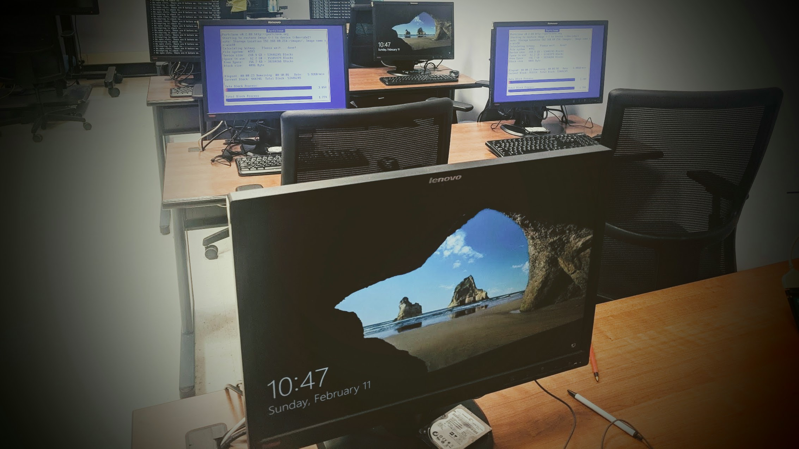

# Technology Lab Infrastructure Upgrade
Updated the hardware infrastructure of a technology lab dedicated to teaching children and senior citizens basic computer skills. This initiative involved replacing outdated equipment with modern hardware to enhance the learning experience and facilitate effective teaching methods.

## Environments and Technologies Used

- 16 Lenovo Thinkcentre M93p workstations
- FOG Project
- Microsoft Office Professional Plus 2019
- Bitdefender GravityZone
- Adobe Creative Cloud

## Operating Systems Used

- Windows 10

## High-Level Deployment and Configuration Steps

- Survey the site and acquire the equipment required based on the workspace assessment
- Configure the wireless access point
- Replace HDDs with SSDs on all 16 workstations
- Prepare first workstation to create an image for deployment
    - Reinstall Windows operating systems and configure system settings
    - Install and configure antivirus software
    - Install Adobe Creative Cloud
- Network boot to FOG Project software and save and image of the workstation
- Network boot to FOG Project on the remaining 15 workstations and deploy the saved image to those machines
- Test all workstations to ensure proper functionality

<h2>Architecture Diagram</h2>

